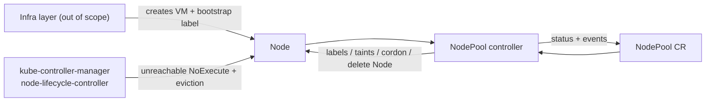
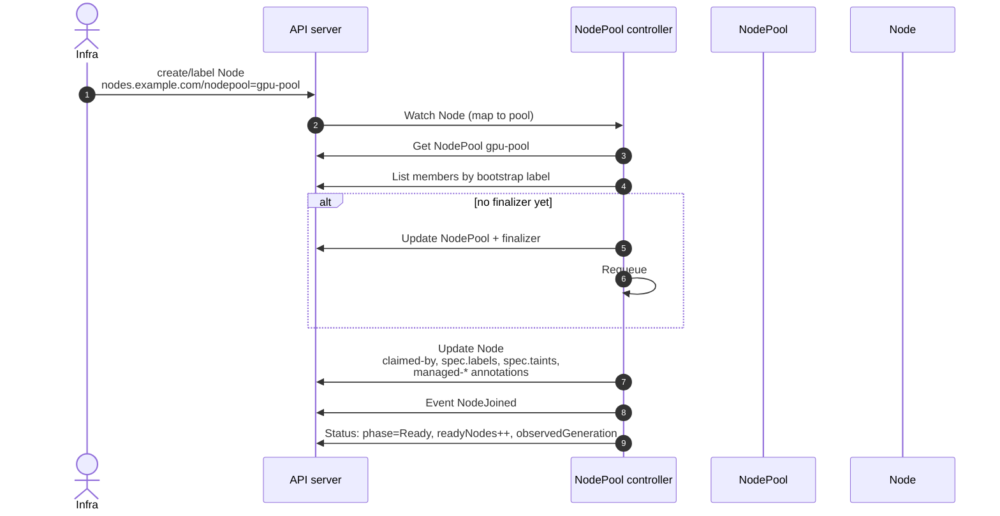
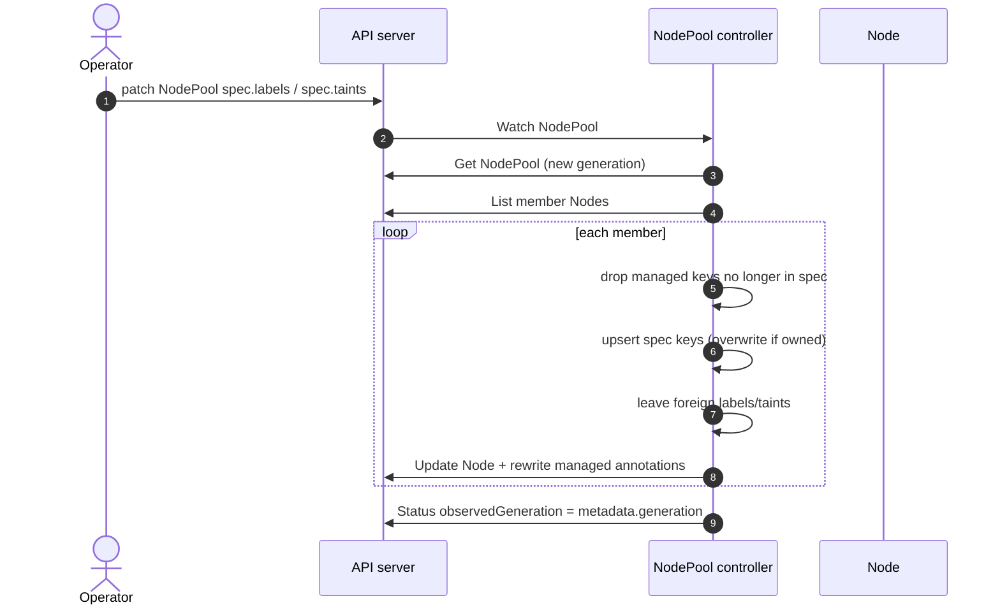
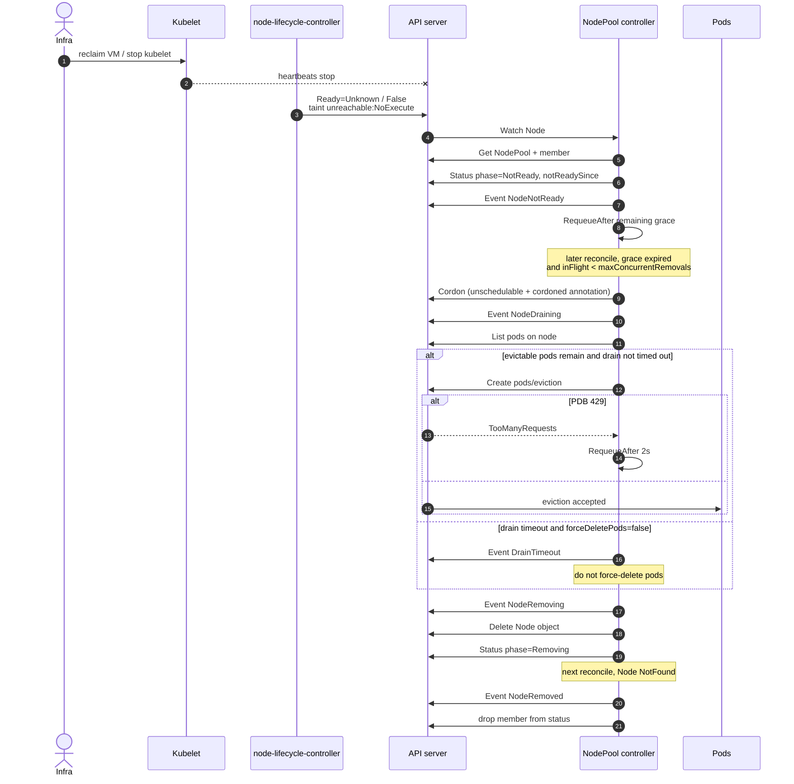
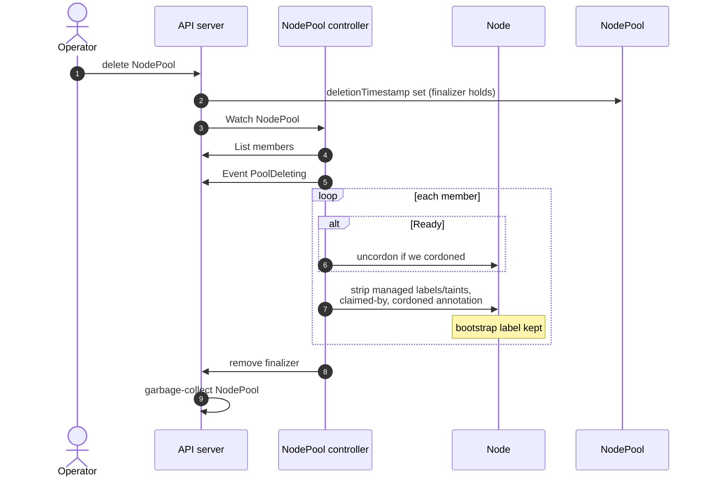

# NodePool controller

Kubernetes control-plane component that owns **NodePool** membership: labels/taints on join, spec propagation, and reactive cleanup when the infra layer reclaims a VM. It does **not** provision machines.

Built with [kubebuilder](https://book.kubebuilder.io/) v4 / controller-runtime v0.25, targeting Kubernetes **1.35+** (CI envtest uses the version pinned by `k8s.io/api` in `go.mod`, currently 1.37).



## Functional behavior

| Signal | Controller action |
| --- | --- |
| Node appears with `nodes.example.com/nodepool=<name>` | Claim node, apply `spec.labels` / `spec.taints`, record member in status |
| Spec labels/taints change | Add new owned keys; remove previously owned keys that left the spec; leave everyone else's keys alone |
| Ready becomes False or Unknown | Start grace clock (`status.nodes[].notReadySince`); after `unreadyPolicy.gracePeriod` run `Remove` / `Cordon` / `Ignore` |
| NodePool deleted | Strip owned labels/taints from members (Ready first, as specified), drop claim, remove finalizer. Does **not** delete Node objects |

State machine for `action: Remove`:

```
Ready → NotReady (clock) → Draining (cordon + eviction API) → Removing (delete Node) → gone
```

`maxConcurrentRemovals` counts members in `Draining` or `Removing`. Reconciliation is **level-triggered**; the loop never `Sleep`s — it returns `RequeueAfter` for remaining grace or drain wait.

## Sequence flows

Watches enqueue the owning NodePool from a Node via the bootstrap label `nodes.example.com/nodepool` or the `claimed-by` annotation. Every path below is one or more level-triggered `Reconcile` calls.

### 1. Node join

Infra (or the demo) stamps the bootstrap label. The controller claims the node, applies owned labels/taints, and records Ready members.



### 2. Spec change (labels / taints)

Owned keys in `managed-labels` / `managed-taints` are added or removed. Foreign keys (kubelet, humans, CCM) are left alone.



### 3. Reactive scale-down (`action: Remove`)

Infra reclaims the VM; kubelet stops heartbeating. `node-lifecycle-controller` taints unreachable independently. After `gracePeriod`, this controller cordons, evicts (PDBs), then deletes the **Node** object — bounded by `maxConcurrentRemovals`.



`Cordon` stops after unschedulable; `Ignore` only records NotReady.

### 4. NodePool deletion

Finalizer blocks removal until owned labels/taints are stripped. Nodes are **not** deleted — infra owns the VMs.



## Build & run locally

Prerequisites: Go 1.26+, Docker, kubectl, [kind](https://kind.sigs.k8s.io/). On macOS, see [Troubleshooting local setup](#troubleshooting-local-setup-macos) if `kind` or the Go link step fails.

```bash
# Unit + envtest (no cluster)
make test

# Kind cluster (see also the Medium kind write-up linked in the assignment)
kind create cluster --name nodepool-demo

# CRDs + controller against the current kubeconfig
make install
make run

# In another terminal: demo (synthetic Node, never drains a real kind worker)
chmod +x hack/demo.sh
./hack/demo.sh
```

In-cluster deploy:

```bash
make docker-build docker-push IMG=<registry>/nodepool-controller:dev
make deploy IMG=<registry>/nodepool-controller:dev
kubectl apply -f config/samples/nodes_v1alpha1_nodepool.yaml
# Simulate join (real or synthetic node):
kubectl label node <name> nodes.example.com/nodepool=gpu-pool
```

### Troubleshooting local setup (macOS)

**`kind create cluster` fails with `Sign in to continue using Docker Desktop`.** Docker Desktop is enforcing org sign-in (`registry.json`); kind cannot list containers until it is satisfied. Sign in to Docker Desktop with the org account (or `docker login`), wait for "Engine running", confirm with `docker ps`, then rerun `kind create cluster --name nodepool-demo`.

**`make install` / `make run` fail at link time with `tapi error: malformed file ... unknown architecture arm64e.x1-macos`.** The default SDK (`MacOSX27.0.sdk`) is newer than the Command Line Tools linker (`ld-1267`, CLT 26.6), so any cgo-linked Go binary (`bin/kustomize`, `cmd/main.go`) fails. Point the build at an SDK the linker understands:

```bash
ls /Library/Developer/CommandLineTools/SDKs/          # pick an installed 26.x SDK
export SDKROOT=/Library/Developer/CommandLineTools/SDKs/MacOSX26.5.sdk
make install
make run
```

Permanent fix: update Command Line Tools so the linker matches the SDK (Software Update, or `sudo rm -rf /Library/Developer/CommandLineTools && xcode-select --install`), then drop `SDKROOT`.

### Demo output

`./hack/demo.sh` against a kind cluster (NodePool `metadata` trimmed):

```text
==> Install CRDs
customresourcedefinition.apiextensions.k8s.io/nodepools.nodes.example.com unchanged
==> Start controller in-process (make run) if one is not already deployed
No in-cluster controller found; starting 'make run' in the background.
Set SKIP_RUN=1 if you already have 'make run' in another terminal.
==> Create NodePool
nodepool.nodes.example.com/gpu-pool created
==> Simulate infra join: create a synthetic Node and stamp the bootstrap label
node/demo-gpu-node created
==> Wait for labels/taints
NAME            STATUS   ROLES    AGE   VERSION   LABELS
demo-gpu-node   Ready    <none>   0s              kubernetes.io/hostname=demo-gpu-node,nodes.example.com/nodepool=gpu-pool,tier=premium,workload=gpu
[{"effect":"NoSchedule","key":"nvidia.com/gpu","value":"true"}]
apiVersion: nodes.example.com/v1alpha1
kind: NodePool
metadata:
  finalizers:
  - nodes.example.com/nodepool
  generation: 2
  name: gpu-pool
spec:
  image: ubuntu-22.04-gpu
  labels:
    tier: premium
    workload: gpu
  taints:
  - effect: NoSchedule
    key: nvidia.com/gpu
    value: "true"
  unreadyPolicy:
    action: Remove
    drainTimeout: 5m0s
    gracePeriod: 5m0s
    maxConcurrentRemovals: 1
status:
  conditions:
  - message: 1/1 members Ready
    observedGeneration: 2
    reason: MembersReady
    status: "True"
    type: Ready
  - message: no in-flight removals
    observedGeneration: 2
    reason: Idle
    status: "False"
    type: Progressing
  - message: ""
    observedGeneration: 2
    reason: NoError
    status: "False"
    type: Failed
  nodes:
  - name: demo-gpu-node
    phase: Ready
  observedGeneration: 2
  readyNodes: 1
==> Simulate infra reclaim: Ready=Unknown (kubelet gone)
node/demo-gpu-node patched
==> Temporarily shorten grace? Sample uses 5m. For demo, patch gracePeriod to 5s.
nodepool.nodes.example.com/gpu-pool patched
==> Wait for controller to delete the Node
[{"name":"demo-gpu-node","notReadySince":"2026-10-08T06:27:41Z","phase":"NotReady"}]
[{"name":"demo-gpu-node","notReadySince":"2026-10-08T06:27:41Z","phase":"NotReady"}]
[{"name":"demo-gpu-node","notReadySince":"2026-10-08T06:27:41Z","phase":"NotReady"}]
[{"name":"demo-gpu-node","notReadySince":"2026-10-08T06:27:41Z","phase":"NotReady"}]
Node demo-gpu-node removed
==> Recreate a Ready member then delete the pool (label cleanup)
node/demo-gpu-node created
nodepool.nodes.example.com "gpu-pool" deleted
Remaining labels on demo-gpu-node:
NAME            STATUS   ROLES    AGE   VERSION   LABELS
demo-gpu-node   Ready    <none>   3s              human=keep-me,nodes.example.com/nodepool=gpu-pool
node "demo-gpu-node" deleted
==> Done. Events:
LAST SEEN   TYPE      REASON         OBJECT              MESSAGE
8s          Warning   NodeNotReady   nodepool/gpu-pool   node demo-gpu-node Ready=Unknown
3s          Normal    NodeJoined     nodepool/gpu-pool   node demo-gpu-node joined pool
3s          Normal    NodeDraining   nodepool/gpu-pool   draining node demo-gpu-node
3s          Normal    NodeRemoving   nodepool/gpu-pool   deleting Node demo-gpu-node
3s          Normal    NodeRemoved    nodepool/gpu-pool   node demo-gpu-node gone
0s          Normal    PoolDeleting   nodepool/gpu-pool   stripping managed labels/taints from members
```

What it shows:

- **Join** — pool labels (`tier`, `workload`) and the `nvidia.com/gpu` taint applied; status `1/1 members Ready`.
- **Reclaim** — `Ready=Unknown` sets `notReadySince`; after the 5s grace the node is drained and the Node object deleted (`NodeDraining` → `NodeRemoving` → `NodeRemoved`).
- **Pool delete** — finalizer strips only managed keys: the foreign `human=keep-me` label survives, and the infra-owned bootstrap label `nodes.example.com/nodepool` is intentionally left in place.

The demo leaves `make run` in the background; stop it with `pkill -f cmd/main.go` when done.

RBAC is generated from `+kubebuilder:rbac` markers (`config/rbac/role.yaml`): NodePool CRUD + status/finalizers, Node get/list/watch/update/patch/delete, Pod get/list/watch/delete, `pods/eviction` create, Event create/patch.

CI: `.github/workflows/test.yml` runs `make test`. `.github/workflows/test-e2e.yml` builds the image, loads it into kind, deploys the manager, and runs `go test ./test/e2e/`.

## Architecture decisions (pros / cons)

Each decision below is written like an ADR: **context → choice → alternatives → trade-offs**. Sequence diagrams for the resulting flows are in [Sequence flows](#sequence-flows) above.

### ADR-1 — Label/taint ownership: managed-key annotations (not SSA)

**Context.** Spec changes must add/remove only keys this controller owns. Nodes are contended (kubelet, CCM, humans, CNI).

**Decision.** Persist owned keys in annotations:
- `nodes.example.com/managed-labels` — JSON array of label keys
- `nodes.example.com/managed-taints` — JSON array of `key:effect`
- `nodes.example.com/claimed-by` — winning NodePool name

Reconcile: drop managed keys that left the spec → upsert spec keys → rewrite annotations. Reserved prefixes and the bootstrap label are never managed. If a human sets a key that is in `spec.labels`, the pool wins on the next reconcile; otherwise foreign keys stay.

| | Pros | Cons |
| --- | --- | --- |
| **Chosen: annotation allow-list** | Debuggable (`kubectl get node -o yaml`); works with strategic-merge clients; survives `kubectl edit`; clear delete set on spec shrink | Annotation can be deleted by a human → ownership “forgotten” until next apply rebuilds it; not native field-manager semantics |
| **Alt: SSA / field managers** | First-class ownership in apiserver | Most Node writers still use SMP; Force fights kubelet keys; non-Force can stick in conflicts |
| **Alt: hash of desired labels** | Cheap drift detection | Does not say *which* keys to delete without also storing a key list |

### ADR-2 — Membership: bootstrap label + claimed-by (no ownerRefs)

**Context.** Infra joins nodes with `nodes.example.com/nodepool=<name>`. Deleting a NodePool must not GC live Nodes (VMs belong to infra).

**Decision.** Watch NodePool + Node. Map Node → pool via bootstrap label **or** `claimed-by`. List members by label selector, then merge names still in `status.nodes` if still labeled/claimed. Cluster-scoped CRD (Nodes are cluster-scoped).

| | Pros | Cons |
| --- | --- | --- |
| **Chosen: label + claim annotation** | Explicit join signal from infra; claim prevents two pools fighting; delete pool does not delete Nodes | Two fields to keep consistent; claim can race under dual-write (first writer wins) |
| **Alt: ownerReferences** | Automatic GC / adopt semantics | Deleting NodePool would GC Nodes — wrong ownership model |
| **Alt: status-only inventory** | Single source of truth on the CR | Join would require an API call into this controller; infra already stamps labels |

### ADR-3 — Grace / drain clocks in NodePool status (not memory)

**Context.** Controller can restart mid–NotReady or mid-drain. Assignment forbids `time.Sleep` in reconcile.

**Decision.** Persist `status.nodes[].notReadySince` and `drainStartedAt`. Fallback if status empty: Node Ready `lastTransitionTime`, then `now`. Wait with `RequeueAfter` (controller-runtime workqueue), never sleep.

| | Pros | Cons |
| --- | --- | --- |
| **Chosen: status timestamps + RequeueAfter** | Survives crash / leader election; level-triggered; no lost in-memory timers | Extra status writes; clock skew vs Node condition time if status never landed |
| **Alt: in-memory timer** | Simple | Lost on restart → grace can restart (delayed removals) or appear expired early |
| **Alt: only Node condition LastTransitionTime** | No status field | Condition can flap / get patched in demos; weaker control of “our” clock |

### ADR-4 — Ready=False and Ready=Unknown share the state machine

**Context.** Both mean the member is not a working Ready node. Force-deleting pods is dangerous when kubelet may still be alive.

**Decision.** Same phases (`NotReady` → drain → remove). Operational difference only for optional force-delete: allowed solely when Ready=`Unknown` and `forceDeletePodsAfterDrainTimeout=true`. Default is **do not** force-delete; delete the Node and let pod GC finish.

| | Pros | Cons |
| --- | --- | --- |
| **Chosen: one FSM, gated force-delete** | Simple operator model; avoids volume/unmount races on False | Unknown can also be a partition (false positive for “kubelet dead”) |
| **Alt: separate policies per Ready status** | More precise | Spec/API complexity; easy to misconfigure |
| **Alt: always force-delete after drain timeout** | Faster cleanup | Orphan writes, stuck VolumeAttachments, split-brain if node was only partitioned |

### ADR-5 — Drain via Eviction API; delete Node object (compose with NLC)

**Context.** `node-lifecycle-controller` already taints unreachable/not-ready and the taint manager evicts. This controller must add pool policy, concurrency, and inventory cleanup.

**Decision.** After grace + `action: Remove`: cordon → `pods/eviction` (skip DaemonSet/mirror/terminating; PDB 429 → requeue) → delete **Node**. Cap concurrent `Draining`/`Removing` with `maxConcurrentRemovals`. Do not reimplement NLC; do not fight NoExecute.

| | Pros | Cons |
| --- | --- | --- |
| **Chosen: eviction + Node delete + concurrency cap** | Honors PDBs; brownout-safe; control plane matches infra reclaim; clear Events/conditions | Not full `kubectl drain` (no volume-detach wait); overlaps somewhat with NLC eviction |
| **Alt: only rely on NLC** | Less code | No pool-scoped grace, no max concurrent removals, Nodes linger forever |
| **Alt: directly delete pods** | Faster | Ignores PDBs; riskier than eviction |

### ADR-6 — Finalizer cleanup strips labels; never deletes Nodes on pool delete

**Context.** Spec requires cleaning labels/taints this controller applied, then removing the pool.

**Decision.** Finalizer `nodes.example.com/nodepool`. On delete: uncordon Ready members we cordoned → `StripManaged` → remove finalizer. Bootstrap label left for infra.

| | Pros | Cons |
| --- | --- | --- |
| **Chosen: strip + finalizer** | Safe teardown; Ready members get schedulable again if we cordoned; no accidental VM/Node wipe | Stuck finalizer if Node updates keep failing; NotReady members still get claim stripped |
| **Alt: delete all member Nodes on pool delete** | Clean inventory | Wrong: infra owns VMs; blows up workloads |

### ADR-7 — Level-triggered reconcile (controller-runtime workqueue)

**Context.** Joins, status flaps, and grace timers all need retries without sleeping in-process.

**Decision.** Watches + `ctrl.Result{RequeueAfter}` / `{Requeue: true}` / errors. Workqueue owns retries and rate limiting.

| | Pros | Cons |
| --- | --- | --- |
| **Chosen: level-triggered + workqueue** | Idempotent; crash-safe; matches Kubernetes controller norms | Multiple reconciles per event; must tolerate stale reads / conflict retries |
| **Alt: edge-triggered + sleep** | Fewer reconciles | Violates assignment; timers die with the process |

### Decision summary

| Area | Chose | Rejected |
| --- | --- | --- |
| Ownership | Managed-key annotations + claim | SSA, hash-only |
| Membership | Bootstrap label + status merge | ownerRefs |
| Timers | Status fields + RequeueAfter | In-memory, Sleep |
| Unready | Shared FSM; force-delete opt-in for Unknown | Separate policies / always force |
| Drain | Eviction API → delete Node | NLC-only or raw pod delete |
| Pool delete | Finalizer strip | Delete member Nodes |

## Design decisions (Q&A from the assignment)

### 1. Label/taint ownership

See [ADR-1](#adr-1--labeltaint-ownership-managed-key-annotations-not-ssa).

### 2. Reconciliation triggers

See [ADR-2](#adr-2--membership-bootstrap-label--claimed-by-no-ownerrefs). Watches: NodePool (primary); Node mapped by bootstrap label or `claimed-by`.

### 3. Grace-period clock

See [ADR-3](#adr-3--grace--drain-clocks-in-nodepool-status-not-memory).

### 4. Ready=False vs Ready=Unknown

See [ADR-4](#adr-4--readyfalse-and-readyunknown-share-the-state-machine).

### 5. Force-delete safety

See [ADR-4](#adr-4--readyfalse-and-readyunknown-share-the-state-machine) and [ADR-5](#adr-5--drain-via-eviction-api-delete-node-object-compose-with-nlc). Default off; if on, only Unknown + grace 0 + concurrency cap.

### 6. Failure modes (crash mid-removal)

Everything that matters is in the API server:

| Crash during | Resume |
| --- | --- |
| After cordon, before eviction | Node unschedulable + `cordoned=true`; next reconcile continues drain |
| After some evictions | Level trigger re-evicts remaining pods |
| After Node delete, before status | `Get` → NotFound → drop member, `NodeRemoved` |
| After finalizer add, before labels | Next reconcile applies labels |
| Mid pool delete | Finalizer remains until strip succeeds |

### 7. Concurrency / two pools, one node

First writer of `claimed-by` wins. Foreign claim → `MembershipConflict`, skip (no steal). Bootstrap label move → old pool releases managed keys so the new pool can attach.

### 8. Composition with kube-controller-manager

See [ADR-5](#adr-5--drain-via-eviction-api-delete-node-object-compose-with-nlc). This controller adds pool labels/taints, grace policy, concurrency cap, Node deletion, and status/events on top of NLC’s unreachable taints.

Inspiration (not used): Cluster API MachineDrain, Karpenter disruption budgets, `kubectl drain` skip logic.

## Observability

Events (on the NodePool): `NodeJoined`, `NodeNotReady`, `NodeReady`, `NodeCordoned`, `NodeDraining`, `NodeRemoving`, `NodeRemoved`, `MembershipConflict`, `DrainTimeout`, `PoolDeleting`.

Conditions (`metav1.Condition`): `Ready`, `Progressing`, `Failed`. `status.observedGeneration` is set after a successful reconcile.

## Known limitations / more time

- No defaulting/validating webhook beyond CRD OpenAPI (CEL could reject reserved label keys at admit time).
- Node list is per-pool label select + status names, not a cluster-wide index of `claimed-by` (fine for thousands of nodes; add a field indexer for 100k).
- Drain does not implement full `kubectl drain` (no `--disable-eviction` honor, no waiting for volume detach).
- No metrics beyond controller-runtime defaults (`reconcile_total`, …). A `nodepool_members{phase=}` gauge would be the next chart.
- Synthetic Nodes in demo/e2e have empty capacity; real kubelets would also post allocatable.
- No multi-arch `docker-buildx` in the demo path.

## Tests

| Layer | What |
| --- | --- |
| `internal/ownership` | foreign labels survive; owned keys overwritten; system taints kept; claim conflict |
| `internal/nodestate` | grace math; status clock wins over condition timestamp after restart |
| `internal/controller` envtest | join, spec propagation, Remove after grace, `maxConcurrentRemovals`, finalizer cleanup, no steal |
| `test/e2e` | kind: manager up + synthetic node join/remove |

## Layout

```
api/v1alpha1/          NodePool CRD types
internal/controller/   reconcile loop
internal/ownership/    managed label/taint bookkeeping
internal/nodestate/    Ready vs NotReady + grace
internal/drain/        eviction, PDB 429, optional force-delete
config/                CRD, RBAC, Deployment (kustomize)
hack/demo.sh           operator demo
```
