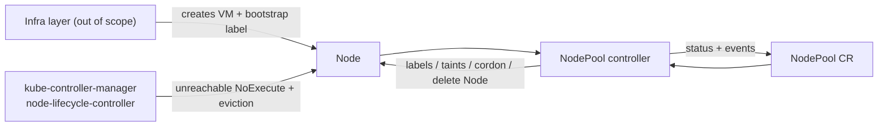

# NodePool controller

Kubernetes control-plane component that owns **NodePool** membership: labels/taints on join, spec propagation, and reactive cleanup when the infra layer reclaims a VM. It does **not** provision machines.

Built with [kubebuilder](https://book.kubebuilder.io/) v4 / controller-runtime v0.25, targeting Kubernetes **1.35+** (CI envtest uses the version pinned by `k8s.io/api` in `go.mod`, currently 1.37).



## Functional behavior

| Signal | Controller action |
| --- | --- |
| Node appears with `nodes.example.com/nodepool=<name>` | Claim node, apply `spec.labels` / `spec.taints`, record member in status |
| Spec labels/taints change | Add new owned keys; remove previously owned keys that left the spec; leave everyone else's keys alone |
| Ready becomes False or Unknown | Start grace clock (`status.nodes[].notReadySince`); after `unreadyPolicy.gracePeriod` run `Remove` / `Cordon` / `Ignore` |
| NodePool deleted | Strip owned labels/taints from members (Ready first, as specified), drop claim, remove finalizer. Does **not** delete Node objects |

State machine for `action: Remove`:

```
Ready → NotReady (clock) → Draining (cordon + eviction API) → Removing (delete Node) → gone
```

`maxConcurrentRemovals` counts members in `Draining` or `Removing`. Reconciliation is **level-triggered**; the loop never `Sleep`s — it returns `RequeueAfter` for remaining grace or drain wait.

## Build & run locally

Prerequisites: Go 1.26+, Docker, kubectl, [kind](https://kind.sigs.k8s.io/).

```bash
# Unit + envtest (no cluster)
make test

# Kind cluster (see also the Medium kind write-up linked in the assignment)
kind create cluster --name nodepool-demo

# CRDs + controller against the current kubeconfig
make install
make run

# In another terminal: demo (synthetic Node, never drains a real kind worker)
chmod +x hack/demo.sh
./hack/demo.sh
```

In-cluster deploy:

```bash
make docker-build docker-push IMG=<registry>/nodepool-controller:dev
make deploy IMG=<registry>/nodepool-controller:dev
kubectl apply -f config/samples/nodes_v1alpha1_nodepool.yaml
# Simulate join (real or synthetic node):
kubectl label node <name> nodes.example.com/nodepool=gpu-pool
```

RBAC is generated from `+kubebuilder:rbac` markers (`config/rbac/role.yaml`): NodePool CRUD + status/finalizers, Node get/list/watch/update/patch/delete, Pod get/list/watch/delete, `pods/eviction` create, Event create/patch.

CI: `.github/workflows/test.yml` runs `make test`. `.github/workflows/test-e2e.yml` builds the image, loads it into kind, deploys the manager, and runs `go test ./test/e2e/`.

## Design decisions

### 1. Label/taint ownership

**Choice: annotation of managed keys**, not SSA.

- `nodes.example.com/managed-labels`: JSON array of keys we last applied from `spec.labels`
- `nodes.example.com/managed-taints`: JSON array of `key:effect`
- `nodes.example.com/claimed-by`: NodePool name that won the race

On reconcile we (1) delete keys listed as managed that are no longer in spec, (2) upsert spec keys, (3) rewrite the annotation to the new set. Keys we never listed stay put (`human=keep-me`, `kubernetes.io/hostname`, `node.kubernetes.io/unreachable`, …). Reserved prefixes (`kubernetes.io/`, `k8s.io/`, `node.kubernetes.io/`, …) and the bootstrap label are never managed.

**Human sets a matching label:** if the key is in `spec.labels`, the pool spec is source of truth — we overwrite on the next reconcile. If the key is *not* in spec and not in the managed annotation, we leave it. That is the contract operators already have with other controllers (CNI, CCM).

**Why not SSA / field managers?** Node is the most contended object in the cluster. kubelet, CCM, and `kubectl label` mostly use strategic-merge patch, not SSA. SSA `Force` on labels would still fight kubelet-owned keys; SSA without Force would leave the object stuck in conflict. An explicit allow-list is debuggable (`kubectl get node -o yaml` shows exactly what we think we own) and survives `kubectl edit`. Cost: we cannot recover ownership if someone deletes the annotation; the next reconcile re-applies spec keys and rebuilds it.

**Why not a hash annotation?** A hash tells you “spec drifted” but not *which* keys to delete. You still need a key list.

### 2. Reconciliation triggers

Watches:

1. `NodePool` (primary)
2. `Node`, mapped to a pool by **bootstrap label** `nodes.example.com/nodepool` **or** `claimed-by` annotation

Membership listing: `List` with label selector `nodes.example.com/nodepool=<pool>` plus `Get` of names still in `status.nodes` (covers a node that lost the bootstrap label but is still claimed). We do **not** use owner references: deleting a NodePool must not GC Node objects — the VM is owned by infra.

Cluster-scoped CRD: Nodes are cluster-scoped; a namespaced NodePool would be a lie.

### 3. Grace-period clock

Persisted on **`status.nodes[].notReadySince`**. That survives leader election and process restart.

If status is empty (crash before the first status write), we fall back to the Node Ready condition’s `lastTransitionTime`, then to `now`. We do **not** keep the timer only in memory.

`status.nodes[].drainStartedAt` is the same idea for drain timeout.

### 4. Ready=False vs Ready=Unknown

**Same state machine.** Both mean “this member is not a working Ready node.”

They are not the same *operationally*:

| | Typical cause | kubelet | Force-delete pods? |
| --- | --- | --- | --- |
| **Unknown** | missed heartbeats / VM gone | likely dead | only if `forceDeletePodsAfterDrainTimeout=true` |
| **False** | kubelet reported NotReady (disk, PID, …) | alive | **never** — kubelet may still be writing volumes |

Default is `forceDeletePodsAfterDrainTimeout: false`. After drain timeout we delete the **Node** object and let kube-controller-manager’s pod GC finish. That is the kubelet-is-gone path without racing a live kubelet.

### 5. Force-delete safety

Eviction API first (honors PDBs; 429 → requeue). Skip DaemonSets, mirror pods, already-terminating pods.

**Default after drain timeout: do not force-delete pods.** Risk of force-delete: orphaned writes, unmount races, stuck VolumeAttachments, split-brain if the node was only partitioned.

Guardrails if the flag is enabled: only when Ready=**Unknown**; grace period 0; still bounded by `maxConcurrentRemovals`.

### 6. Failure modes (crash mid-removal)

Everything that matters is in the API server:

| Crash during | Resume |
| --- | --- |
| After cordon, before eviction | Node unschedulable + `cordoned=true` annotation; next reconcile continues drain |
| After some evictions | Level trigger: remaining evictable pods are evicted again (idempotent) |
| After Node delete, before status | Next reconcile `Get` → NotFound → drop member, emit `NodeRemoved` |
| After finalizer add, before labels | Next reconcile applies labels |
| Mid pool delete | Finalizer remains until strip succeeds |

No in-memory work queue that can be lost.

### 7. Concurrency / two pools, one node

A Node has one value for `nodes.example.com/nodepool`. First reconciler to write `claimed-by` wins. If another pool sees a foreign claim, it **does not steal**: Warning event `MembershipConflict`, `Failed=True` on that pool, skip the node.

If infra moves the bootstrap label to another pool, the old pool **releases** (strip managed keys + claim) so the new pool can attach.

We never set ownerRefs that would cause cross-GC.

### 8. Composition with kube-controller-manager

`node-lifecycle-controller` already taints `node.kubernetes.io/unreachable:NoExecute` (and `not-ready`) and the taint manager evicts.

This controller adds **pool identity and inventory**:

- Desired labels/taints from the NodePool spec (GPU NoSchedule, etc.)
- A **grace policy** that is a NodePool decision, not a cluster-wide kube-controller-manager flag
- **Concurrency cap** so a brownout does not delete the whole pool
- **Deletion of the Node object** so the control plane matches infra reclaim (NLC does not delete Nodes by default)
- Pool-level status, conditions, and events for operators

We skip DaemonSet pods on drain the same way `kubectl drain` does; we do not fight NoExecute eviction — if pods are already terminating, drain is a wait.

Inspiration (not copied): Cluster API MachineDrain rules, Karpenter disruption budgets, `kubectl drain` skip logic. None of those operators are used here.

## Observability

Events (on the NodePool): `NodeJoined`, `NodeNotReady`, `NodeReady`, `NodeCordoned`, `NodeDraining`, `NodeRemoving`, `NodeRemoved`, `MembershipConflict`, `DrainTimeout`, `PoolDeleting`.

Conditions (`metav1.Condition`): `Ready`, `Progressing`, `Failed`. `status.observedGeneration` is set after a successful reconcile.

## Known limitations / more time

- No defaulting/validating webhook beyond CRD OpenAPI (CEL could reject reserved label keys at admit time).
- Node list is per-pool label select + status names, not a cluster-wide index of `claimed-by` (fine for thousands of nodes; add a field indexer for 100k).
- Drain does not implement full `kubectl drain` (no `--disable-eviction` honor, no waiting for volume detach).
- No metrics beyond controller-runtime defaults (`reconcile_total`, …). A `nodepool_members{phase=}` gauge would be the next chart.
- Synthetic Nodes in demo/e2e have empty capacity; real kubelets would also post allocatable.
- No multi-arch `docker-buildx` in the demo path.

## Tests

| Layer | What |
| --- | --- |
| `internal/ownership` | foreign labels survive; owned keys overwritten; system taints kept; claim conflict |
| `internal/nodestate` | grace math; status clock wins over condition timestamp after restart |
| `internal/controller` envtest | join, spec propagation, Remove after grace, `maxConcurrentRemovals`, finalizer cleanup, no steal |
| `test/e2e` | kind: manager up + synthetic node join/remove |

## Layout

```
api/v1alpha1/          NodePool CRD types
internal/controller/   reconcile loop
internal/ownership/    managed label/taint bookkeeping
internal/nodestate/    Ready vs NotReady + grace
internal/drain/        eviction, PDB 429, optional force-delete
config/                CRD, RBAC, Deployment (kustomize)
hack/demo.sh           operator demo
```
